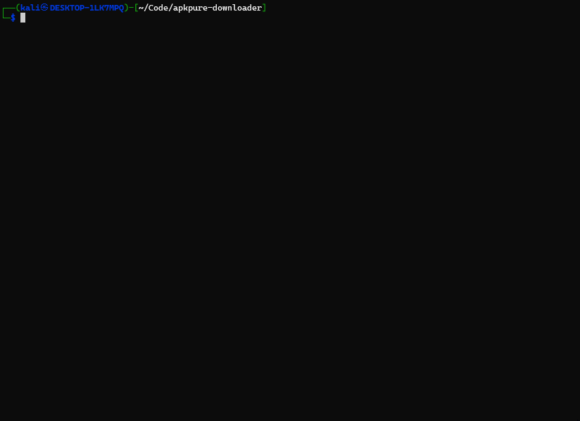
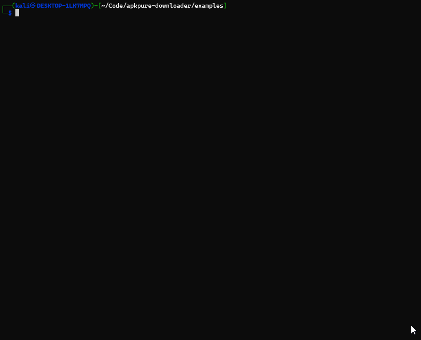

# apkpure

CLI tool to inspect and download APK / XAPK packages from ApkPure.

## Installation & Build

```bash
pnpm install
pnpm run build
npm link # optional: make 'apkpure' available globally
```

## Commands & Usage




### 1. `apkpure info`
Inspect all available versions for a package with an `Offset` index column.

```bash
apkpure info com.instagram.android
apkpure info "whatsapp"
apkpure info com.instagram.android --abi arm64-v8a,armeabi-v7a
```

### 2. `apkpure download`
Download packages using slicing (`--limit`, `--offset`), concurrency (`--threads`), and ABI filtering.

```bash
# Download latest version (default: limit=1, offset=0)
apkpure download com.instagram.android

# Download a specific older version using offset from `info`
apkpure download com.instagram.android --offset 3 --limit 1

# Download multiple versions concurrently (max 5 threads)
apkpure download com.instagram.android --limit 5 --threads 3

# Download all versions
apkpure download com.instagram.android --all --threads 4

# Skip prompts in automation / scripts
apkpure download com.instagram.android --unattended

# Specific output path
apkpure download com.instagram.android --output ./downloads
```

### 3. `apkpure output`
Show or set default persistent download directory.

```bash
# View current default output path
apkpure output

# Set default output directory
apkpure output /path/to/apks
```

## Options Reference

| Command | Option | Description | Default |
|---|---|---|---|
| `apkpure` | `--version` | Display CLI version | - |
| `apkpure` | `--help` | Display help information | - |
| `info` | `--abi <list>` | Filter by comma-separated ABIs | - |
| `download` | `--limit <n>` | Number of logical versions to download | `1` |
| `download` | `--offset <n>` | Number of versions to skip from latest | `0` |
| `download` | `--all` | Download all available versions | `false` |
| `download` | `--threads <n>` | Concurrent downloads (`1` to `5`) | `1` |
| `download` | `--unattended` | Fail instead of prompting on ambiguous queries | `false` |
| `download` | `--abi <list>` | Preferred / required ABI list | - |
| `download` | `--output <path>` | Custom destination directory for this run | configured path |

# API Node.js / SDK



```js
import { ApkPure } from "apkpure";

const client = new ApkPure({ outputDir: "./downloads" });

// Configuration
client.getOutputDir();
client.setOutputDir("/path/to/apks");

// Search and versions
const apps = await client.searchPackages("browser");
const versions = await client.getPackageVersions("com.whatsapp");
const info = await client.getPackageInfo("com.instagram.android");

// Download
const result = await client.downloadPackage("com.instagram.android", {
  limit: 2,
  offset: 0,
  threads: 3,
  outputDir: "./downloads",
})
```